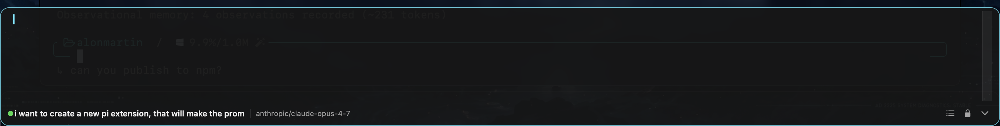
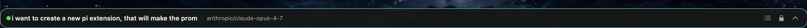
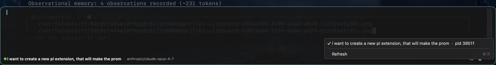

# pi-sticky-prompt

> Always-on-top, full-width macOS prompt bar for [pi](https://github.com/earendil-works/pi).



Pi runs in normal terminal scrollback (not alternate-screen mode), so when
you scroll the terminal up to read history, the input prompt scrolls out
of view with everything else. **pi-sticky-prompt** solves that with a
tiny native macOS window that sits permanently on top of every other
window, on every space, and talks to your live pi sessions over a Unix
domain socket.

You can scroll the terminal as much as you want — the prompt stays glued
to the bottom of the screen.

### Demo

https://github.com/user-attachments/assets/4b8a7e41-6df2-4bf2-98d3-4cd1513aefd9

| Collapsed | Session picker |
| --- | --- |
|  |  |

```
┌──────────────────────────────────┐         ┌──────────────────────────┐
│ Terminal running pi              │  UDS    │ PiStickyPrompt.app       │
│ (interactive, scrollback intact) │ ◄────── │ floating NSPanel         │
│                                  │         │ always on top            │
└──────────────────────────────────┘         └──────────────────────────┘
```

## Features

- 🪟 **Native floating window** — `NSPanel` with `.floating` level + `.canJoinAllSpaces`. Visible above every app, every space, even fullscreen Ghostty / Terminal / iTerm.
- 🖥️ **Auto-docked** to the bottom edge of whichever screen has a terminal app open. Plug in a monitor or move Terminal across screens — the bar follows.
- 🔒 **Lock / unlock** — locked: full-width pinned to bottom; unlocked: free-move, resize, drag between monitors.
- 📜 **Multi-session aware** — every pi process publishes its own socket; the bar lists all live sessions in a picker (`⌘L`) and remembers your selection across launches.
- ⌨️ **Global hotkey** `⌘⌥P` to toggle visibility from anywhere on the system.
- 📉 **Collapse to a one-line preview** of long input (`⌘M`); expanding grows upward leaving the toolbar flush with the screen edge.
- 🚦 **Status echo** — model, session name, and a live streaming indicator (green = idle, yellow = streaming, red = disconnected).
- ↩️ **Auto-focus the terminal** after sending — keystrokes you make right after pressing Enter land in the terminal hosting that pi session, not in the bar.
- 🛑 **Abort current pi turn** with `Esc`; press `Esc` twice quickly to hide the bar.

## Requirements

- macOS 13+
- A pi installation (`@mariozechner/pi-coding-agent`)
- Xcode command-line tools for building the HUD: `xcode-select --install`
- Swift 5.9+ (ships with current macOS)

Tested with Ghostty, Terminal.app, iTerm2, Alacritty, WezTerm, kitty, and Warp.

## Install

### As a pi package

```bash
# from npm
pi install npm:pi-sticky-prompt

# or directly from the repo
pi install git:github.com/alonmartin2222/pi-sticky-prompt

# pin to a specific version
pi install git:github.com/alonmartin2222/pi-sticky-prompt@v0.1.0

# or from a local checkout
pi install /path/to/pi-sticky-prompt
```

That installs the **extension half** — the bridge that lets pi sessions
expose themselves over a socket. You still need to build and launch the
**HUD** once.

### Build and launch the HUD

```bash
cd "$(pi config | awk '/pi-sticky-prompt/ {print $2}')"   # or cd into the package directory directly
make            # builds PiStickyPrompt.app in the current directory
make install    # copies it to ~/Applications
make run        # builds + opens it
```

`make install` drops `PiStickyPrompt.app` into `~/Applications`. Add it
to your Login Items in System Settings if you want it always running.

## Usage

1. Start any number of `pi` sessions in any terminal. Each session writes:
   - **socket**:     `~/.pi/agent/sockets/pi-<pid>.sock`
   - **descriptor**: `~/.pi/agent/sockets/pi-<pid>.json`
2. Launch `PiStickyPrompt.app`. It scans the descriptor directory and
   auto-attaches to the most-recent live session (or the one you previously
   chose).
3. Type. **Enter** sends; **Shift+Enter** inserts a newline.

### Keys

While the bar has keyboard focus:

| Key                | Action                                              |
| ------------------ | --------------------------------------------------- |
| **⌘⌥P** *(global)* | Toggle bar visibility from anywhere on the system   |
| **Enter**          | Send the prompt to the attached pi session          |
| **Shift+Enter**    | Insert a newline inside the editor                  |
| **Esc**            | Abort current pi turn (twice quickly: hide bar)     |
| **⌘M**             | Collapse to one-line preview / expand back          |
| **⌘L**             | Open the session picker                             |
| **⌘W**             | Hide the bar                                        |

A status-bar icon (`π▸`) also exposes Toggle / Pick Session / Quit.

### Toolbar

```
[●  session-name  │  model/name]                       [≡  🔒  ▲]
 │   │                │                                 │   │   │
 │   │                │                                 │   │   └ collapse / expand
 │   │                │                                 │   └ lock / unlock
 │   │                │                                 └ session picker
 │   │                └ provider/model
 │   └ session name (or cwd basename if unnamed)
 └ status dot: green = idle · yellow = streaming · red = disconnected
```

When idle, sending a prompt triggers a new turn. When pi is mid-turn (yellow
dot), sending **steers** the running turn instead of queueing — same
behaviour as typing in the pi TUI itself.

### Lock vs unlock

- **🔒 locked** *(default)* — full screen-width, pinned to the bottom of
  whichever screen has a terminal app open. Re-snaps automatically on
  display changes (`NSApplication.didChangeScreenParametersNotification`).
- **🔓 unlocked** *(orange tint)* — drag from any background pixel to
  move, drag from the edges to resize, drag freely between monitors. The
  last unlocked frame is remembered. Click again to re-dock.

## Architecture

Two pieces:

```
extensions/sticky-prompt.ts        ← TypeScript pi extension
PiStickyPrompt/                    ← Swift Package for the macOS HUD
├── Package.swift
├── Sources/PiStickyPrompt/
│   ├── main.swift                 ← entry point, sets accessory activation
│   ├── AppDelegate.swift          ← menu-bar item + global hotkey wiring
│   ├── HUDController.swift        ← owns the panel, picks a session, locking
│   ├── HUDPanel.swift             ← NSPanel subclass; canBecomeKey overrides
│   ├── PromptView.swift           ← top toolbar + editor + status row
│   ├── PromptTextView.swift       ← NSTextView with Enter/Esc/⌘M handling
│   ├── BridgeClient.swift         ← UDS client; line-delimited JSON protocol
│   ├── SessionDiscovery.swift     ← scans ~/.pi/agent/sockets for live pids
│   ├── TerminalScreen.swift       ← finds which NSScreen hosts a terminal
│   ├── TerminalLocator.swift      ← walks parent PIDs to find owning terminal
│   └── Hotkey.swift               ← Carbon RegisterEventHotKey wrapper
└── make-app.sh                    ← bundles the binary into a .app
```

### Wire protocol

Line-delimited JSON over the Unix domain socket (LF only, both directions):

```
server -> client
  {"type":"hello",  pid, cwd, sessionFile, sessionName?, model?, streaming, started}
  {"type":"state",  streaming, model?, sessionName?}
  {"type":"ack",    ok, command:"prompt"|"abort", error?}
  {"type":"bye"}

client -> server
  {"type":"prompt", text}
  {"type":"abort"}
  {"type":"ping"}
```

You can drive the bridge from the shell to verify it without the HUD:

```bash
SOCK=$(ls -t ~/.pi/agent/sockets/pi-*.sock | head -1)
echo '{"type":"prompt","text":"hello from nc"}' | nc -U "$SOCK"
```

### Permissions

- **No Accessibility permission** required. We never use AX APIs.
- **No Screen Recording permission** required. `CGWindowListCopyWindowInfo`
  returns window owner + bounds without it; we read only those, never
  pixels or window names.
- The global hotkey uses Carbon's `RegisterEventHotKey`, which works for
  accessory (LSUIElement) apps without any permission prompts.

### Auto-focus to terminal on send

After a successful `prompt` ack, the HUD walks the BSD process tree
upward from the pi session's PID using `sysctl(KERN_PROC_PID)` until it
finds an ancestor whose bundle ID matches a known terminal app (Ghostty,
Terminal, iTerm2, Alacritty, WezTerm, kitty, Warp, Hyper). It then calls
`NSRunningApplication.activate(.activateIgnoringOtherApps)` on that app.
This brings the terminal to the front so your next keystroke goes to pi
output instead of the now-empty input bar.

## Multiple pi sessions

The pi extension publishes one socket + descriptor per pi process. The
HUD scans the directory, hides any whose PID is no longer running, and
shows the rest in the session picker (`⌘L`). The current selection is
persisted in `UserDefaults` as `pi.preferredPID` so re-launches reattach
to the same session if it's still alive.

Heads-up: macOS doesn't expose per-window activation through
`NSRunningApplication`. If you have multiple windows of the same terminal
app, only the most-recently-focused one of that app comes forward. Per-
window raising would require Accessibility permission, which this project
deliberately avoids.

## Disabling

- Hide the bar with `⌘⌥P` or quit it from the menu bar.
- To remove the extension half: `pi remove npm:pi-sticky-prompt` (or
  whichever spec you used to install it).
- To keep the extension but stop the HUD: just don't launch the app. The
  socket sits unused; pi sessions don't notice.

## Limitations

- The bar is **viewport-pinned** because it is a separate macOS window,
  not because pi affects terminal scrollback. Terminal scrollback itself
  is unchanged.
- One HUD process per machine is the intended deployment. Multiple HUDs
  can connect to the same socket but they will all see each other's
  state echoes.
- macOS only. The HUD uses AppKit. The pi extension itself is
  cross-platform Node code, but the only client implementation today is
  the macOS app.
- Tested only on macOS 13+ on Apple Silicon. Intel builds should work
  (the binary is built for `arm64` only by default — drop in a
  universal slice in `make-app.sh` if needed).

## Contributing

Issues and PRs welcome at <https://github.com/alonmartin2222/pi-sticky-prompt>.
The codebase is intentionally small:

- `extensions/sticky-prompt.ts` — ~250 lines TypeScript
- `PiStickyPrompt/Sources/PiStickyPrompt/*.swift` — ~900 lines Swift

Build the Swift app with `make debug` to get faster rebuild loops while
iterating. Use `swift build -c debug` directly if you don't need the
`.app` bundle.

The Carbon `RegisterEventHotKey` symbol signature is `'piPb'` (`0x70695062`)
— historical, but kept stable so config files stay portable.

## License

MIT — see [LICENSE](./LICENSE).
